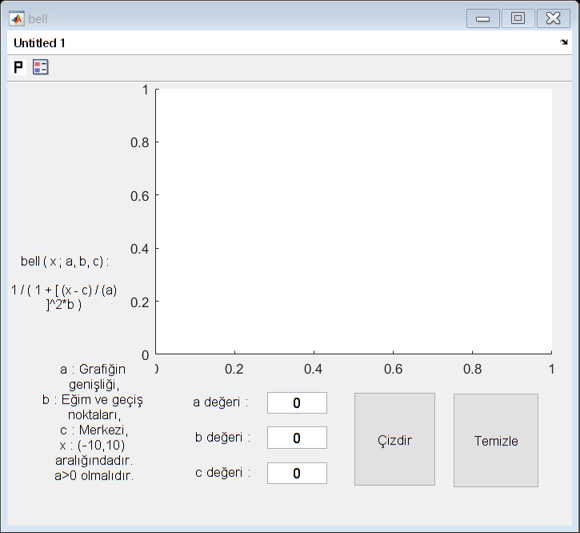
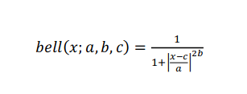

# matlab_generalized_bell_remembership_function
It is a matlab program that draws generalized bell remembership function with entered data

LinkedIn : https://www.linkedin.com/in/batuhansener3553/

 

